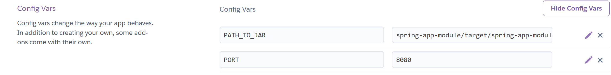

Project regarding university discipline called "Software Tools" 

The application is deployed on the Heroku platform  
@ https://pu-soft-tools.herokuapp.com/  
Two Environment Variables are set on the platform and used in the Procfile: 
- $PORT=8080  
- $PATH_TO_JAR=spring-app-module/target/spring-app-module-1.0-SNAPSHOT.jar 
  
 